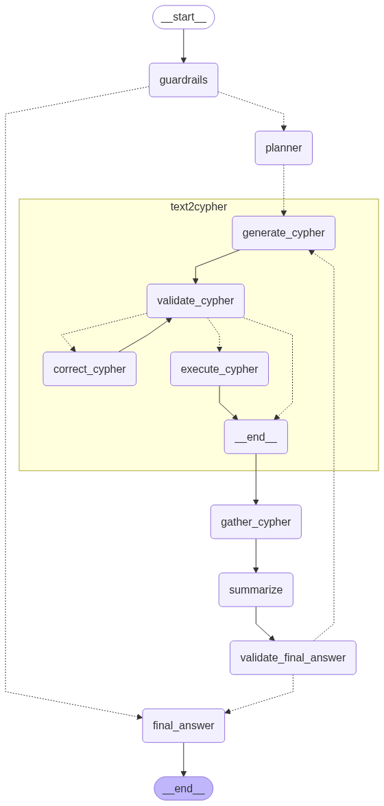

# Neo4j Text2Cypher

A robust Text2Cypher agent for Neo4j using LangGraph. This project demonstrates how to build a comprehensive natural language to Cypher query system with guardrails, validation, error correction, and a clean modular architecture.

## Features

- **Text2Cypher Conversion**: Convert natural language questions to Cypher queries using few-shot learning
- **Guardrails**: Validate questions are within scope before processing
- **Query Planning**: Break down complex questions into subtasks
- **Cypher Validation**: Multi-layered validation (syntax, security, semantics) with rule-based and optional LLM validation
- **Error Correction**: Iterative correction of invalid Cypher queries with configurable max attempts
- **Result Gathering**: Safe execution and result collection from Neo4j
- **Answer Summarization**: Natural language formatting of query results
- **Final Answer Validation**: Quality check with optional loop-back for corrections
- **Streamlit UI**: Clean web interface with expandable query sections
- **Jupyter Examples**: Complete notebook examples for learning and testing
- **Unified Configuration**: Single YAML file for all app settings and examples

## Architecture

The system follows a modular LangGraph workflow with comprehensive error handling:

### Core Components

- **Guardrails**: Ensures questions are within scope using graph schema validation
- **Planner**: Breaks down complex questions into subtasks
- **Text2Cypher Pipeline**: 
  - **Generation**: Creates Cypher using retrieval-augmented few-shot examples
  - **Validation**: Multi-layer validation (syntax, security, semantic correctness)
  - **Correction**: Iterative error fixing with max attempt limits
  - **Execution**: Safe query execution with result gathering
- **Summarization**: Formats raw results into natural language responses
- **Final Answer Validation**: Quality assurance with conditional retry loops

### Workflow Diagram



*The diagram above shows the complete LangGraph workflow with all components and decision points, including the detailed Text2Cypher pipeline with generation, validation, correction, and execution steps.*

## Quick Start

### 1. Installation

```bash
git clone <repository-url>
cd neo4j-text2cypher
make init  # or poetry install --with dev,ui
```

### 2. Environment Setup

Copy the environment template and add your credentials:

```bash
cp .env.example .env
```

Edit `.env` with your Neo4j and OpenAI credentials:

```env
NEO4J_USERNAME="neo4j"
NEO4J_PASSWORD="your_password"
NEO4J_URI="bolt://localhost:7687"
NEO4J_DATABASE="neo4j"
OPENAI_API_KEY="sk-your_openai_key"
```

### 3. Configure Your Application

Create or edit your application configuration file (e.g., `example_apps/iqs_data_explorer/app-config.yml`):

```yaml
neo4j:
  database: "your_database_name"
  # uri: "bolt://localhost:7687"  # Optional override

streamlit_ui:
  title: "Your App Name"
  scope_description: "Description of what your app can answer"
  example_questions:
    - "How many customers do we have?"
    - "What products are available?"

example_queries:
  - question: "How many customers do we have?"
    cql: "MATCH (c:Customer) RETURN count(c) as customerCount"
  - question: "What products are available?"
    cql: "MATCH (p:Product) RETURN p.name as productName LIMIT 10"
```

The configuration file combines all settings in one place:
- **Neo4j settings**: Database connection details
- **UI configuration**: App title, description, and example questions
- **Query examples**: Question-Cypher pairs for few-shot learning

### 4. Run the Application

#### Streamlit Web App
```bash
make streamlit file_path=example_apps/iqs_data_explorer/app-config.yml
```

#### Jupyter Notebook
```bash
jupyter notebook example_apps/iqs_data_explorer/iqs_data_explorer_example.ipynb
```

#### Python Code
```python
import asyncio
from neo4j_text2cypher.workflows.neo4j_text2cypher_workflow import create_neo4j_text2cypher_workflow
from neo4j_text2cypher.retrievers.cypher_examples.unified_config_retriever import UnifiedConfigCypherExampleRetriever
from langchain_neo4j import Neo4jGraph
from langchain_openai import ChatOpenAI

async def main():
    # Initialize components
    graph = Neo4jGraph(enhanced_schema=True)
    llm = ChatOpenAI(model="gpt-4o", temperature=0)
    retriever = UnifiedConfigCypherExampleRetriever("example_apps/iqs_data_explorer/app-config.yml")

    # Create workflow
    agent = create_neo4j_text2cypher_workflow(
        llm=llm,
        graph=graph,
        cypher_example_retriever=retriever,
        scope_description="This answers questions about your graph database."
    )

    # Ask a question
    response = await agent.ainvoke({
        "question": "How many nodes are in the database?",
        "data": [],
        "history": []
    })

    print(response["answer"])

# Run the async function
asyncio.run(main())
```

## Configuration

### Unified YAML Configuration

The project uses a single YAML configuration file that combines all settings:

```yaml
neo4j:
  database: "your_database"
  # uri: "bolt://localhost:7687"  # Optional override

streamlit_ui:
  title: "Your App Title"
  scope_description: "What your app can answer"
  example_questions:
    - "Example question 1"
    - "Example question 2"

example_queries:
  - question: "Your question"
    cql: "MATCH (n) RETURN count(n)"
  - question: "Another question"
    cql: "MATCH (n:Label) RETURN n LIMIT 10"
```

### Workflow Parameters

Configure the workflow behavior:
- `llm_cypher_validation`: Enable LLM-based validation (slower but more accurate)
- `max_attempts`: Maximum correction attempts for invalid Cypher (default: 3)
- `attempt_cypher_execution_on_final_attempt`: Execute query even if validation fails on final attempt
- `enable_final_answer_validation`: Enable quality check of final answers with potential retry

## Development

### Commands

```bash
make init           # Initialize development environment
make test           # Run all tests
make test_unit      # Run unit tests only
make format         # Format code with ruff
make clean          # Fix formatting and linting issues
make mypy           # Run type checking
make streamlit      # Run Streamlit app (requires file_path parameter)
make langgraph      # Start LangGraph Studio development server
```

### Project Structure

```
neo4j-text2cypher/
├── neo4j_text2cypher/           # Main package
│   ├── components/              # LangGraph node components
│   │   ├── guardrails/          # Input validation and scope checking
│   │   ├── planner/             # Question decomposition
│   │   ├── text2cypher/         # Core T2C pipeline
│   │   │   ├── generation/      # Cypher query generation
│   │   │   ├── validation/      # Multi-layer validation
│   │   │   ├── correction/      # Error correction
│   │   │   └── execution/       # Safe query execution
│   │   ├── gather_cypher/       # Result collection
│   │   ├── summarize/           # Natural language formatting
│   │   ├── final_answer/        # Final output generation
│   │   └── validate_final_answer/ # Answer quality validation
│   ├── retrievers/              # Example retrieval systems
│   │   └── cypher_examples/     # Few-shot example retrievers
│   ├── workflows/               # LangGraph workflow definitions
│   ├── ui/                      # Streamlit web interface
│   └── utils/                   # Utility functions
├── example_apps/                # Example applications
│   └── iqs_data_explorer/       # Sample app with configuration
├── tests/                       # Comprehensive test suite
│   ├── unit/                    # Unit tests for components
│   └── conftest.py             # Test configuration
└── docs/                        # Documentation (if any)
```

## Customization

### Adding New Components

1. Create component in `neo4j_text2cypher/components/your_component/`
2. Implement `node.py` with your logic
3. Add to workflow in `workflows/neo4j_text2cypher_workflow.py`

### Custom Example Retrievers

Implement `BaseCypherExampleRetriever` for custom example sources:

```python
from neo4j_text2cypher.retrievers.cypher_examples.base import BaseCypherExampleRetriever

class CustomRetriever(BaseCypherExampleRetriever):
    def get_examples(self, question: str, k: int = 5) -> List[Dict]:
        # Your custom retrieval logic here
        return examples
```

Available retrievers:
- `UnifiedConfigCypherExampleRetriever`: YAML-based configuration
- `YAMLCypherExampleRetriever`: Simple YAML file retriever
- `Neo4jVectorExampleRetriever`: Vector similarity-based retrieval

### Custom Validation Rules

Extend validation by adding rules in `components/text2cypher/validation/validators.py`:

```python
def custom_validation_rule(cypher: str) -> ValidationResult:
    # Your domain-specific validation logic
    if some_condition(cypher):
        return ValidationResult(is_valid=False, error_message="Custom error")
    return ValidationResult(is_valid=True)
```

## Examples

See `example_apps/iqs_data_explorer/iqs_data_explorer_example.ipynb` for a complete walkthrough including:
- Environment setup and initialization
- Workflow creation and configuration
- Example queries with step-by-step execution
- Result analysis and customization tips
- Testing different validation approaches

The example demonstrates a real-world use case with Honda/Acura vehicle feedback data, showing:
- Complex multi-hop queries
- Filtering and aggregation patterns
- Natural language result formatting
- Error handling and correction

## Testing

The project includes comprehensive testing:

```bash
make test           # Run all tests
make test_unit      # Run unit tests only
```

Tests cover:
- Component functionality and integration
- Workflow execution and state management
- Configuration loading and validation
- Error handling and edge cases

## Contributing

1. Follow the existing code style (use `make format` and `make clean`)
2. Add comprehensive tests for new functionality
3. Ensure type hints are present (`make mypy`)
4. Update documentation as needed
5. Test with real Neo4j databases when possible

## License

Apache License, Version 2.0